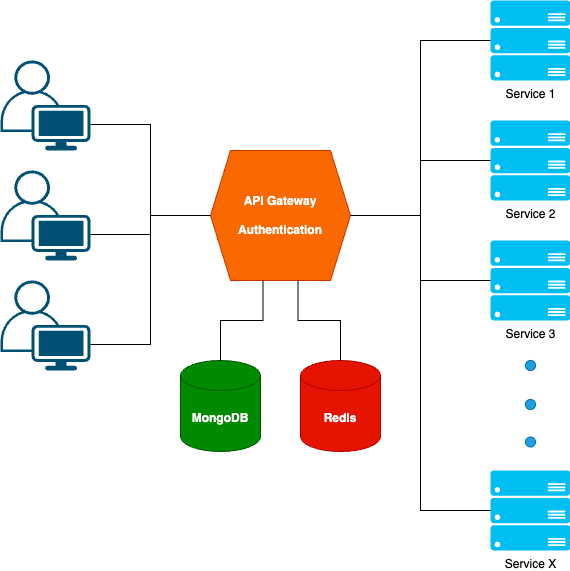
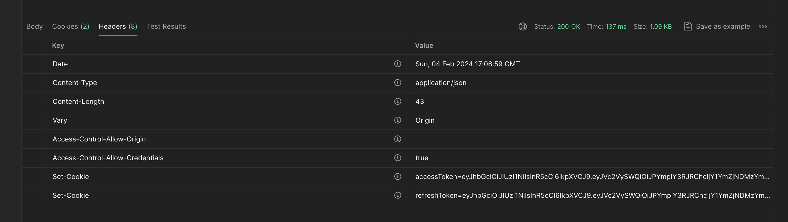
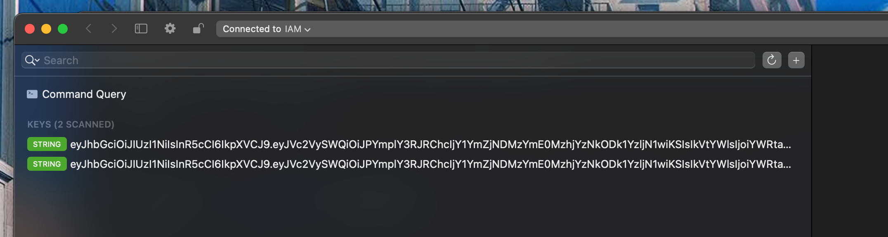

<h1>stc-auth-service</h1>
<h2>Introduction</h2>
<ul>This project was created with the purpose of studying authentication and authorization within microservices, with a specific focus on the API Gateway. </ul>
<p align="center">
  
</p>
<h2>Project Structure</h2>

```text
stc-auth-service/
├── 🗂️config/
├──── 📄config.go
├── 🗂️controllers/
├──── 📄auth_test.go
├──── 📄auth.go
├── 🗂️middleware/
├──── 📄auth.go
├── 🗂️models/
├──── 📄auth.go
├── 🗂️pkgs/
├──── 🗂️databasePkg/
├────── 📄mongo.go
├────── 📄redis.go
├──── 🗂️jwtPkg/
├────── 📄jwt.go
├──── 🗂️responsePkg/
├────── 📄response.go
├──── 🗂️validationPkg/
├────── 📄validation.go
├── 🗂️repositories/
├──── 📄mongo_mock.go
├──── 📄mongo.go
├──── 📄redis_mock.go
├──── 📄redis.go
├── 🗂️router/
├──── 📄auth.go
├── 🗂️services/
├──── 📄auth_mock.go
├──── 📄auth_test.go
├──── 📄auth.go
├── 📄main.go
```
<h2>Getting started</h2>
<ul>
<li>
  <h4>Installation</h4>  
  
  Clone and install Go packages.
  ```
  $ git clone https://github.com/santichoks/stc-auth-service.git
  $ cd stc-auth-service
  $ go get ./...
  ```
</li>
<li>
  <h4>Setting Environment</h4>
  
  Create an `.env` file in the application root directory.
  ```
  ACCESS_ORIGINS = <ACCESS_ORIGINS>
  SERVICE_LISTS = <SERVICE_LISTS>
  MONGO_HOST = <MONGODB_HOST>
  MONGO_USERNAME = <MONGO_USERNAME>
  MONGO_PASSWORD = <MONGO_PASSWORD>
  REDIS_HOST = <REDIS_HOST>
  REDIS_PASSWORD = <REDIS_PASSWORD>
  JWT_ACCESS_TOKEN_SECRET = <JWT_ACCESS_TOKEN_SECRET>
  JWT_ACCESS_TOKEN_DURATION = <JWT_ACCESS_TOKEN_DURATION>
  JWT_REFRESH_TOKEN_SECRET = <JWT_REFRESH_TOKEN_SECRET>
  JWT_REFRESH_TOKEN_DURATION = <JWT_REFRESH_TOKEN_DURATION>
  ```
  For example
  ```
  ACCESS_ORIGINS = http://localhost:3000
  SERVICE_LISTS = [{ "host": "https://pokeapi.co", "alias": "/pokeapi" }]
  MONGO_HOST = mongodb://localhost:27017
  MONGO_USERNAME = root
  MONGO_PASSWORD = @123456
  REDIS_HOST = localhost:6379
  REDIS_PASSWORD = @123456
  JWT_ACCESS_TOKEN_SECRET = jwt-access-token-secret
  JWT_ACCESS_TOKEN_DURATION = 86400
  JWT_REFRESH_TOKEN_SECRET = jwt-refresh-token-secret
  JWT_REFRESH_TOKEN_DURATION = 2592000
  ```
</li>
<li>
  <h4>Docker Compose for MongoDB and Redis</h4>
  
  You can create `docker-compose.yml` and run cmd `docker-compose up` to install mongodb and redis.
  ```
  version: '3.8'
  name: database
  services:
    mongodb:
      image: mongo
      container_name: mongo-auth-database
      ports:
        - <MONGODB_PORT>:27017 
      environment:
        MONGO_INITDB_ROOT_USERNAME: <MONGO_USERNAME>
        MONGO_INITDB_ROOT_PASSWORD: <MONGO_PASSWORD>
    redis:
      image: redis
      container_name: redis-auth-database
      ports:
        - <REDIS_PORT>:6379
      command: redis-server --requirepass <REDIS_PASSWORD>
  ```
  For example
  ```
  version: '3.8'
  name: database
  services:
    mongodb:
      image: mongo
      container_name: mongo-auth-database
      ports:
        - 27017:27017 
      environment:
        MONGO_INITDB_ROOT_USERNAME: root
        MONGO_INITDB_ROOT_PASSWORD: @123456
    redis:
      image: redis
      container_name: redis-auth-database
      ports:
        - 6379:6379
      command: redis-server --requirepass @123456
  ```
</li>
<li>
  <h4>Let's Start</h4>

  ```
  go run .
  ```
</li>
</ul>

<h2>Authentication API</h2>
<ul>
<li>
  <h4>Health Check</h4>

  |Endpoint|Method|Example|
  |:-:|:-:|-|
  |`/healthz`|GET|`http://localhost:8080/healthz`|

  Example Response
  ```
  {
    "statusCode": 200,
    "message": "healthy"
  }
  ```
</li>
<li>
  <h4>Sign Up</h4>
  
  |Endpoint|Method|Example|
  |:-:|:-:|-|
  |`/signup`|POST|`http://localhost:8080/signup`|

  Example Request
  ```
  {
    "firstName": "santichok",
    "lastName": "sangarun",
    "email": "admin@stc.com",
    "password": "12345678"
  }
  ```
  Example Response : `accessToke` and `refreshToken` in cookie.
  ```
  {
    "statusCode": 200,
    "message": "successfully"
  }
  ```
  <p align="center">
    
  </p>
</li>
<li>
  <h4>Login</h4>

  |Endpoint|Method|Example|
  |:-:|:-:|-|
  |`/login`|POST|`http://localhost:8080/login`|

  Example Request
  ```
  {
      "email": "admin@stc.com",
      "password": "12345678"
  }
  ```
  Example Response : `accessToke` and `refreshToken` in cookie.
  ```
  {
      "statusCode": 200,
      "message": "successfully"
  }
  ```
  <p align="center">
    
  </p>
</li>
<li>
  <h4>Logout</h4>
  
  |Endpoint|Method|Example|
  |:-:|:-:|-|
  |`/logout`|POST|`http://localhost:8080/logout`|
  
  Example Response : `accessToke` and `refreshToken` in black list (redis).
  ```
  {
      "statusCode": 200,
      "message": "successfully"
  }
  ```
  <p align="center">
    
  </p>
</li>
</ul>

<h2>API Gateway</h2>
<ul>
<li>
  <h4>Overview</h4>
  
  The API Gateway is like a middleman between your users and different services. It's a central hub that helps send requests to different services using specific aliases. This makes it easier to keep service details hidden and lets you smoothly connect with many backend services.
</li>
<li>
  <h4>Configuration in .env file</h4>
  
  In your `.env` file, you can define a list of services with their corresponding hosts and aliases using the `SERVICE_LISTS` variable. Each service should be represented as a JSON object with `host` and `alias` keys.

  ```
  SERVICE_LISTS=[{ "host": "https://pokeapi.co", "alias": "/pokeapi" }]
  ```
</li>
<li>
  <h4>Request Structure</h4>
  
  Clients can make requests to the API Gateway using the following URL structure
  ```
  http://localhost:8080/gateway/<SERVICE_ALIAS>/<SERVICE_ENDPOINT>
  ```

`<SERVICE_ALIAS>`: The alias specified for the desired service.

`<SERVICE_ENDPOINT>`: The path specific to the service.
</li>


<li>
  <h4>Usage</h4>
  
  |Endpoint|Method|Example|
  |:-:|:-:|-|
  |`/gateway/<SERVICE_ALIAS>/<SERVICE_ENDPOINT>`|ANY|GET `http://localhost:8080/gateway/pokeapi/api/v2/pokemon`|

  `/gateway` is the base path for the API Gateway.
  
  `/pokeapi` is the alias specified for the PokeAPI service.
  
  `/api/v2/pokemon/` is the specific route for retrieving Pokémon information.

  Example Request

  ```
  GET http://localhost:8080/gateway/pokeapi/api/v2/pokemon/
  ```
  
  Example Response
  ```
  {
      "count": 1302,
      "next": "https://pokeapi.co/api/v2/pokemon/?offset=20&limit=20",
      "previous": null,
      "results": [
          {
              "name": "bulbasaur",
              "url": "https://pokeapi.co/api/v2/pokemon/1/"
          },
          {
              "name": "ivysaur",
              "url": "https://pokeapi.co/api/v2/pokemon/2/"
          },
          {
              "name": "venusaur",
              "url": "https://pokeapi.co/api/v2/pokemon/3/"
          },
          ...
          ...
          ...
      ]
  }
  ```
</li>
<li>
  <h4>Internal Processing</h4>

  <p>1. The API Gateway middleware first checks for authorization before processing the request.</p>
  
  <p>2. After authorization, the gateway constructs a request to the next service by removing "/gateway" and replacing the alias with the service-specific path.</p>
  
  <p>3. The final request sent to the PokeAPI service looks like this</p>

  ```
  GET https://pokeapi.co/api/v2/pokemon
  ```
</li>
</ul>
